# Bowser-operated Web Push

Status: proposed implementation plan. Tracking: `bowser-browser-fy6e`.
The owner selected a Bowser-operated service. This document does not enable
push, deploy infrastructure, or promise that system WKWebView can support the
required integration.

An isolated signed [delivery probe](web-push-proof.md) proves worker payload and
notification-click dispatch after tab closure on the development machine.
Standard subscription creation still fails without a push daemon; the full
integration gate remains open.

## Architecture

```mermaid
flowchart LR
    Site[Website application server] -->|Encrypted Web Push POST| Relay[push.bowser.app / Phoenix]
    Relay --> Queue[(Durable encrypted queue)]
    Queue -->|Authenticated outbound connection| Desktop[Bowser push client]
    Desktop -->|Decrypt and route by profile / registration| Worker[WebKit service worker]
    Worker -->|showNotification| Native[Native permission checks / macOS notification]
    Native -->|notificationclick| Worker
```

Use `push.bowser.app` as the proposed dedicated hostname. Build the relay with
Elixir and Phoenix, packaged in Docker behind the existing Caddy installation.
Use a separate service and database volume from registration, analytics, and
updates so push traffic and queue failures do not interrupt those services.
Reuse the repository's container hardening and `bowser_edge` network approach;
do not publish a backend port to the internet.

The relay stores encrypted payloads and delivers them to authenticated Bowser
installations. Websites keep their existing standard Web Push sender code when
it accepts arbitrary standards-compliant subscription endpoints. Vendors that
hard-code supported browser providers may need compatibility work; we cannot
promise every site's Enable Notifications button will work unchanged.

## The engine integration is the first gate

Owning the relay solves transport, not the browser API. Bowser still needs real
`PushManager.subscribe/getSubscription/permissionState`, durable subscriptions,
service-worker activation, `push` event dispatch with `waitUntil`,
`showNotification`, and `notificationclick` handling with `clients.openWindow`.
A page-level Notification replacement does not provide these.

The installed public WKWebsiteDataStore headers expose no push integration.
Upstream WebKit provides private data-store push processing methods. Its
MiniBrowser configures a separate test daemon, and Apple's daemon path checks a
private entitlement. These sources establish an integration risk, not proof that
Bowser can use those methods in a signed production application:
[private data-store API](https://github.com/WebKit/WebKit/blob/main/Source/WebKit/UIProcess/API/Cocoa/WKWebsiteDataStorePrivate.h),
[MiniBrowser](https://github.com/WebKit/WebKit/blob/main/Tools/MiniBrowser/mac/AppDelegate.m),
[daemon admission](https://github.com/WebKit/WebKit/blob/main/Source/WebKit/webpushd/PushClientConnection.mm).

Before building the production relay, prove that a normally signed Bowser host
can bind a custom endpoint to an actual service-worker registration and dispatch
a local test message to that worker after its tab closes. Use isolated state,
test keys, the installed WebKit build, and normal signing; no Apple-private
entitlements or changes to system services. Trace where WebKit expects its own
daemon and where a Bowser transport can attach. Check the minimum supported
macOS version as well as the development machine.

If system WebKit cannot support this, stop production implementation and bring
back evidence and options. Shipping a maintained WebKit build or changing the
engine is a separate architecture decision. A cloud relay alone cannot remove
this blocker. Do not expose successful subscriptions before delivery is possible.

## Subscription and sender contract

After a user gesture and site approval, the browser creates a subscription tied
to installation, profile/data-store ID, exact origin, service-worker registration,
and the website's application-server public key. Saved apps use a distinct
installation namespace. Private browsing does not create persistent subscriptions.

The website receives an opaque HTTPS endpoint and public subscription key
material. Private decryption keys and authentication secrets stay on the Mac,
protected in Keychain. Persist the registration-to-subscription mapping locally;
the relay needs opaque subscription and installation IDs, not page URLs or
profile names. Separate sender endpoint tokens from device-management credentials.

Proposed external surface: `POST /v1/push/:opaqueToken`. Follow the relevant
Web Push request/response, TTL, urgency and topic replacement semantics, including
empty messages and expired subscriptions. Validate before acknowledging durable
acceptance; do not acknowledge only an in-memory enqueue. Implement and test the
sender-facing requirements from [RFC 8030](https://www.rfc-editor.org/rfc/rfc8030).

Support `aes128gcm` encrypted payloads and use published encryption vectors.
Payload decryption happens on the desktop; the relay does not receive plaintext
notification text or private subscription keys.
[RFC 8291](https://www.rfc-editor.org/rfc/rfc8291).

Validate VAPID signatures, audience and expiry, and bind restricted subscriptions
to the application-server key supplied at subscription. Do not fetch a VAPID
contact URL or treat it as verified identity. Follow
[RFC 8292](https://www.rfc-editor.org/rfc/rfc8292).

## Queue and desktop delivery

Use PostgreSQL for durable subscriptions, queue entries, expiry and delivery
leases. Phoenix PubSub may wake connected consumers but must not be the queue.
Start with one replica and bounded storage; avoid adding Redis or a separate
message broker until measured load requires it.

The desktop initiates one authenticated TLS WebSocket connection per installation.
This is our internal delivery protocol, not a claim to implement RFC 8030's
HTTP/2 receiver transport. Authenticate before any delivery and scope every
subscribe, fetch, acknowledgement and deletion to the installation. Support
credential rotation and revocation, replay-resistant acknowledgements, reconnect
backoff with jitter, and a bounded local inbox.

Use durable message IDs, leases, retry after disconnect, TTL expiry and
subscription-scoped topic replacement. Delivery is at least once; a persisted
desktop inbox suppresses duplicate dispatch where possible. A crash during worker
execution can still produce ambiguous completion. Do not promise exactly-once
notifications or silently lose messages by acknowledging before durable receipt.

Initial operational limits to validate under load: 4 KiB encrypted bodies,
24-hour maximum retention, and 100 queued messages per installation, plus global
byte and subscription limits. Advertise effective TTL and return explicit quota
responses instead of silently dropping accepted messages. Test empty messages,
maximum-size payloads, replacement, saturation, restarts and expiration.

The service still observes installation IPs, delivery timing, ciphertext sizes,
and VAPID public identities. Redact endpoint tokens, authentication headers and
payloads from application and proxy logs. Keep push operational metrics separate
from product telemetry. Apply bounded enrollment, sender/device/IP rate limits,
key revocation and a service kill switch.

## Browser behavior and lifecycle

Request permission only for the requesting secure origin and profile, respecting
macOS notification denial. Save Allow/Block exceptions in Website settings.
Blocking or resetting revokes the subscription, cancels pending delivery locally,
and queues remote deletion if offline. Validate permission and registration again
at delivery. Profile deletion removes keys, subscriptions and queued messages.

The native adapter displays notifications only through a valid worker request,
routes clicks to that same profile/registration, and enforces visible-notification
policy for user-visible subscriptions. Reject cross-profile, stale registration
and forged notification identifiers. Remove the saved-app page shim only when
the native worker integration replaces its behavior.

First delivery milestone: receive while Bowser is running, including when the
site's tab is closed. When Bowser is fully quit, the relay queues until its TTL
expires or the browser reconnects. Sleep/offline delivery resumes on reconnect;
an outbound socket does not wake a sleeping Mac.

Delivery while fully quit needs a separately designed background helper and a
worker host that can safely use the correct WebKit store without concurrent
store ownership. Background execution and auto-launch after Quit need an explicit
product decision. They are not included silently in the first milestone.

## Delivery order and evidence

1. Prove signed system-WebKit subscription, worker dispatch and click routing.
   This is a dependency for production implementation, not a deployed test daemon.
2. Implement the Phoenix relay and authenticated desktop transport, with protocol
   vectors, durable retry/expiry tests, isolation tests and abuse limits.
3. Integrate native permissions, Keychain subscription state, worker lifecycle and
   macOS notifications. Cover revocation races and profile/app separation.
4. Run an end-to-end HTTPS fixture using an unmodified standard Web Push sender:
   subscribe, close tab, send encrypted payload, display notification, click into
   the correct profile; then repeat across relaunch, offline retry and revocation.
5. Prepare Docker/Caddy/DNS configuration, migrations, backup/restore procedure,
   queue monitoring and rollback. Deploy only after the exact target and release
   are reviewed. No server connection or deployment occurs as part of this plan.

Release acceptance requires the engine gate, sender interoperability, crash and
queue recovery, profile isolation, permission revocation, signed bundle checks,
and a real notification click test. Native integration initially requires a normal
quit/reopen; subsequent UI and compatible server/backend changes can update
independently. Document unsupported sites and lifecycle limits with test evidence.
